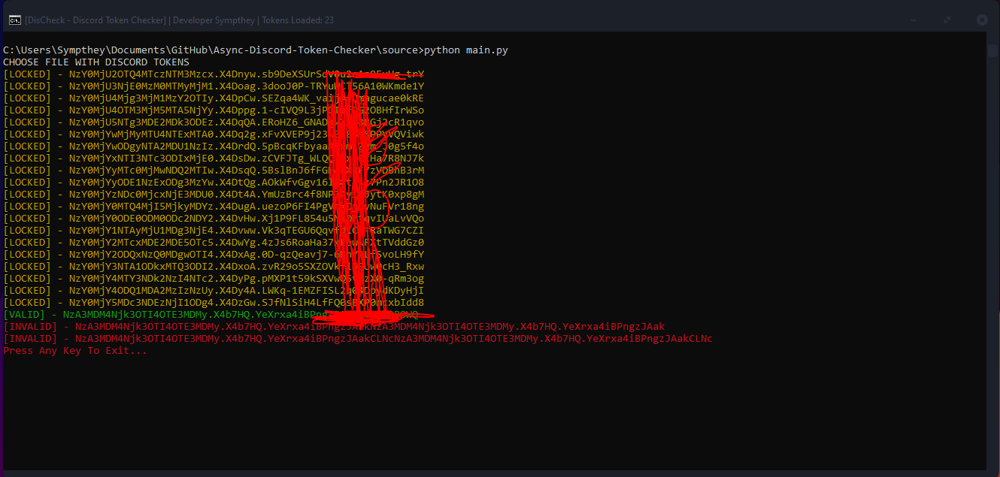

# DisCheck - Asynchronous Token Checker
> Account Also known as 'Token' checker for the popular discord.com service

---

## Table Of Contents
- [Installation](#Installation) 
- [How To Use](#How-To-Use)
- [Developer Info](#Developer-Contact)
- [License](#License)

---
## Installation
- Download Python 3 - python.org
- Download the contents of the github repo.
- Install the modules needed in the requirements.txt `pip install requirements.txt`
---
## How To Use
After you have completed the [installtion](#Installation) its as easy as running the script.  This can be done like so `python main.py`. Once it has ran a dialog box will show, naviagte to where your discord tokens are saved and then it will run the checker. 
`The Results are saved into the 'results' folder.`

---
## License
MIT License

Copyright (c) [2020] [Sympthey]

Permission is hereby granted, free of charge, to any person obtaining a copy
of this software and associated documentation files (the "Software"), to deal
in the Software without restriction, including without limitation the rights
to use, copy, modify, merge, publish, distribute, sublicense, and/or sell
copies of the Software, and to permit persons to whom the Software is
furnished to do so, subject to the following conditions:

The above copyright notice and this permission notice shall be included in all
copies or substantial portions of the Software.

THE SOFTWARE IS PROVIDED "AS IS", WITHOUT WARRANTY OF ANY KIND, EXPRESS OR
IMPLIED, INCLUDING BUT NOT LIMITED TO THE WARRANTIES OF MERCHANTABILITY,
FITNESS FOR A PARTICULAR PURPOSE AND NONINFRINGEMENT. IN NO EVENT SHALL THE
AUTHORS OR COPYRIGHT HOLDERS BE LIABLE FOR ANY CLAIM, DAMAGES OR OTHER
LIABILITY, WHETHER IN AN ACTION OF CONTRACT, TORT OR OTHERWISE, ARISING FROM,
OUT OF OR IN CONNECTION WITH THE SOFTWARE OR THE USE OR OTHER DEALINGS IN THE
SOFTWARE.

[Back To The Top](#Asynchronous-Discord-Token-Checker)

---
# Developer Contact

- Discord: Sympthey#9640

[Back To The Top](#Asynchronous-Discord-Token-Checker)